#### 年龄-性别估计

##### 一、C3AE
C3AE: Exploring the Limits of Compact Model for Age Estimation  
code: [https://github.com/StevenBanama/C3AE](https://github.com/StevenBanama/C3AE)  
1. 对于小尺寸输入图片， 标准卷积要优于深度可分离卷积。  
2. 年龄两点表示法, 如下图所示，年龄由相邻两个年龄范围加权求得。  
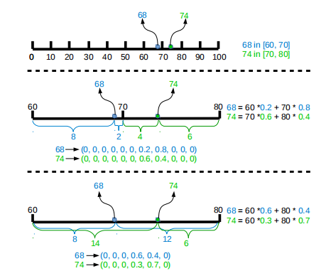  
3. 联合训练,在特征层和回归层之间插入语义全连接层，定义两个loss， KL loss和MAE loss  
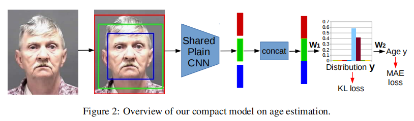  
KL loss测量真实值标签与预测年龄分布之间的差异，采用kl -散度作为度量  
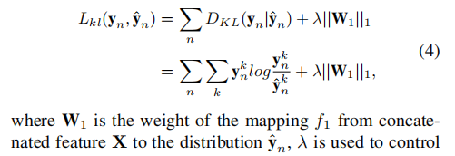  
MAE loss控制最终年龄的预测，实现为L1距离  
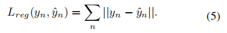  
总损失为两个loss相加  
4. 我们以三种粒度级别裁剪人脸中心，然后将它们输入到共享的CNN网络中。最后对三尺度人脸图像的瓶颈进行串级处理。  
5. 不适用残差网络，对于小模型残差网络不好，本文使用SE module.  

##### 二、Mean-Variance Loss  
在本文中，我们提出了一种新的损失函数，称为均值-方差损失，用于通过分布学习进行稳健年龄估计。具体来说，均值-方差损失包括均值损失和方差损失，均值损失用于惩罚估计年龄分布的均值与真实年龄之间的差异，方差损失用于惩罚估计年龄分布的方差以确保集中分布。所提出的mean-variance loss和softmax loss被联合嵌入到卷积神经网络（cnn）用于年龄估计。  
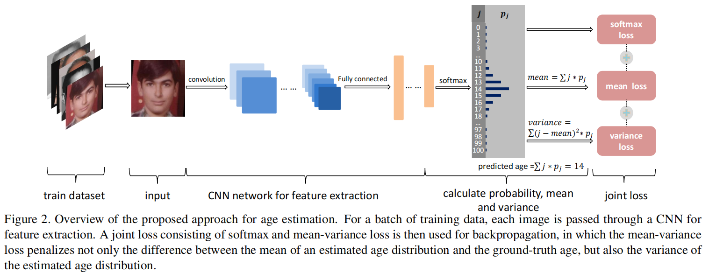  
1. Mean-Variance Loss  
年龄分类的softmax公式如下所示  
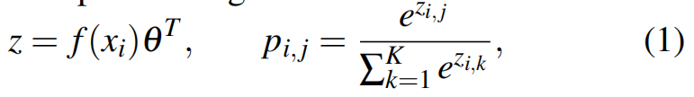  
均值和方差计算如下mi和vi所示  
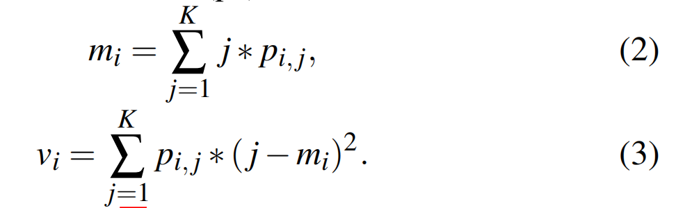  
平均损失分量惩罚估计年龄分布的平均值与真实年龄之间的差异,公式如下：  
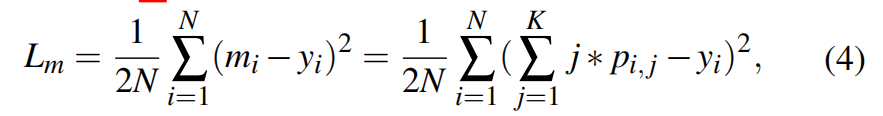  
方差损失惩罚估计年龄分布的离散性, 公式如下：  
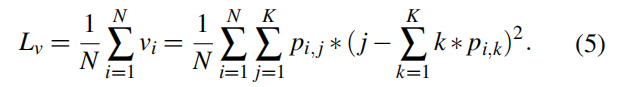  
2. Embedding into CNNs  
采用softmax损失和均值方差损失联合作为监督信号，公式如下  
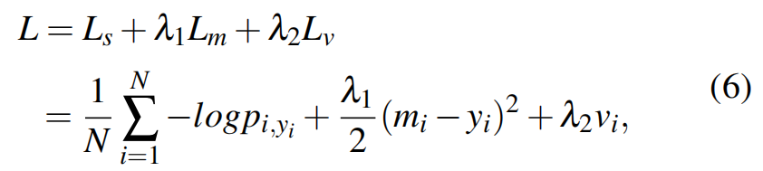  
推理是的年龄公式如下公式所示  
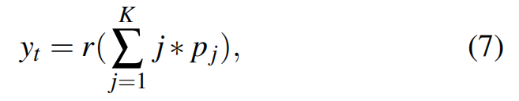  
3. 优势总结  
1) 将估计的分布移向基本事实,在迭代过程中，网络可以逐渐产生一个更好的分布，其均值越来越接近ground-truth age。  
2) 从两边挤压估计的分布, 在迭代过程中，网络会产生一个尖锐的分布。  
3) 为单个类分配不同程度的贡献, 对于一般的softmax损失，给定一个正类，更新网络时对所有负类都一视同仁。不同的是，在我们的任务中，年龄标签是有序的和可比较的。  

