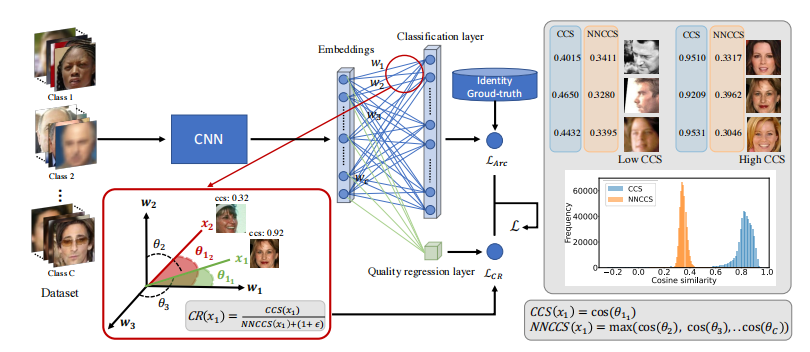
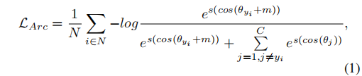
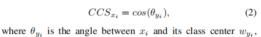
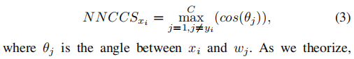
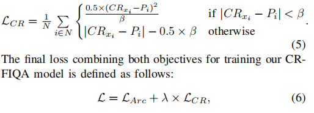

### 图像质量评价

#### CR-FIQA
论文： https://arxiv.org/abs/2112.06592  
代码： https://github.com/fdbtrs/CR-FIQA  
在FR模型的训练阶段，模型可以方便地将高质量的样本推到离其类中心较近而离其他类中心相对较远的地方。相反，FR不能将低质量的样本同样程度地推到类中心，因此它们会比高质量的样本离类中心相对更远。基于这一假设，我们将我们的方法理论化，指出在训练期间导致人脸样本相对靠近其类中心的属性是使其成为高质量样本的属性，反之亦然。因此，学习在任何给定的样本中预测这些属性将导致学习评估该样本质量。  
  
1. 主干网络使用arc-face loss.  
  
2. 类中心角相似度CCS。在FR模型训练阶段，通过推动每个样本xi靠近其类中心wj，远离其他（负）类中心wj(j!=yi)，来训练模型以增强类（身份）之间的可分离性.  
  
3. 最接近负类中心角相似度NNCCS,表示xi与最近的负类中心wj(j!=yi)之间的接近度.  
  
4. CR, 我们通过CCS与NNCS的比率来衡量这种相对可分类性  
  
5. 我们选用Smooth L1-loss，它避免了L2可能引起的梯度爆炸，并且比L1更易于收敛， 公式如下：  
  
